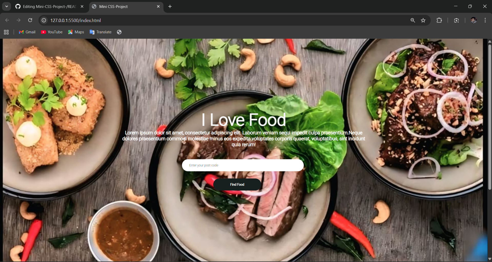

# Mini CSS Project 🍔

A simple food-themed website built using HTML and CSS.

## Screenshots

## Features
- Hero section with background image
- Product listing layout
- Clean and simple UI
- Beginner-friendly design

## Technologies Used
- HTML5
- CSS3

## Project Structure
mini-css-project
├── index.html
├── style.css
└── images

## Author
Hemanth
